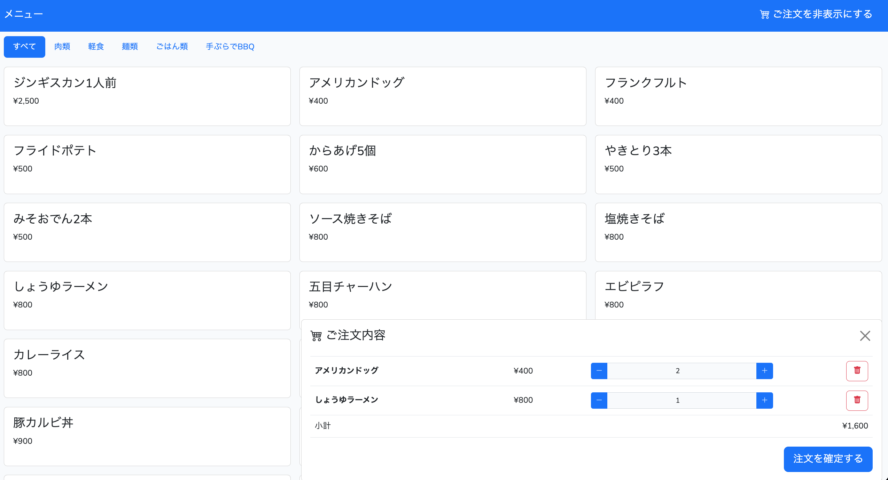
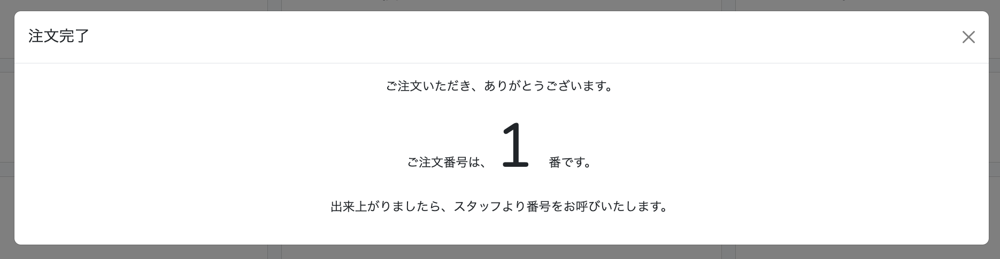
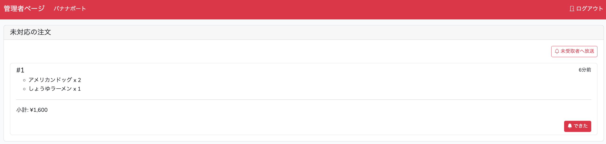
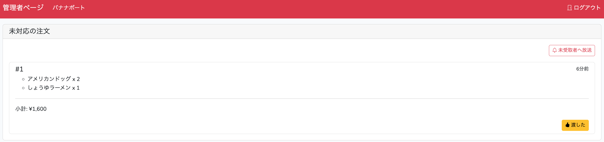
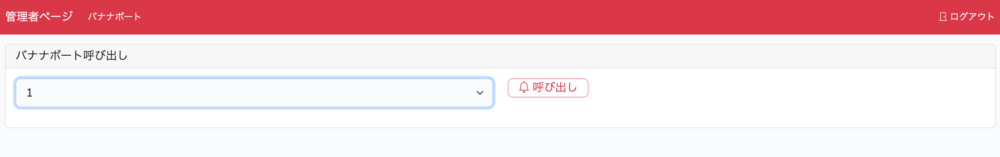

# Order and call system at the beach house

# The reason why I made this system

I am a surfing enthusiast and often ride the waves on the beach in Hokkaido during the summer season. In the summer of 2023, I was consulted by the staff of a beach house with which I had a relationship.  
One of the problems, and the biggest problem, was that the tasks of taking orders, preparing and serving meals were concentrated on one person. Thus, I made this system for more ease of taking order and serving meals.  

# Functions of this system

This system has 2 main functions: a menu of meals that can be viewed and ordered through a smartphone or tablet, and an audio broadcast to inform people when their meal is ready.  

## A menu of meals



We can see the menu of meals from this page, and can order by tapping the item. The order details are displayed in a floating dialogue in the bottom right-hand corner, where we can cancel the order or increase/decrease the number of pieces.  
The following dialogue is then displayed by tapping the 'Confirm order' button (The sentence of "注文を確定する" is it.) at the end of the floating dialogue:  



We can confirm the order number.  

## Order list on the staff page

On the screen, which can only be seen by staff, the orders described in the previous chapter are stored in this way:



Staff then prepare the meal as per the respective order and tap the 'meal ready' button ("できた" is it.) when it is ready to be served. When the button tapped, an automated voice played and customers can know the meal has been available for pick-up through the order number.  



After tapped the 'meal ready' button, it changes into 'meal served' button ("渡した" is it.). When staff tap it again, the order disappears from the list.  

## Calling users when banana boat is ready

The beach house also provides banana boat ride activity. However, there is a waiting period before the activity becomes available. This is because there are preparations such as connecting water bike and banana boat. Therefore, a function was needed to call the user when the banana boat was ready.



The staff member selects a number from the select box and taps the 'Call' button("呼び出し" is it.). Then, automated voice also played.

# how to develop on local

After cloning this repository and move to the root directory, then do below.

```
$ sail up -d
$ sail npm run dev
```

# The problem

However, as this project was done for free and not for business, I had to adopt a compromised approach.  
Therefore, I released the system through the free AWS Lightsail slot, hoping that the attackers would not destroy the system. Fortunately, there were no attacks and the system worked successfully for the duration of the season :tada:  
